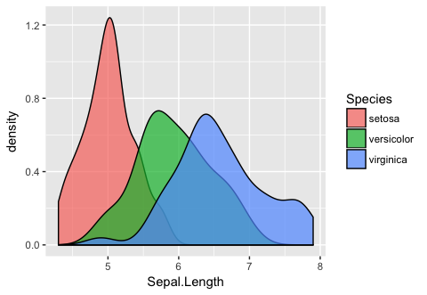
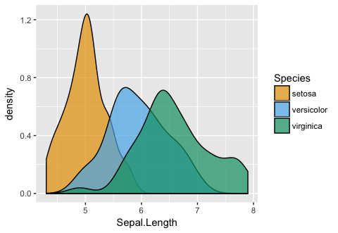
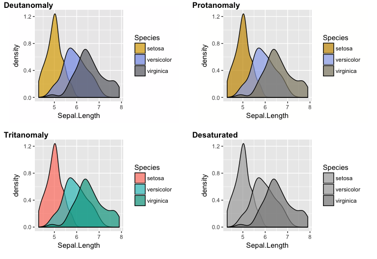

<!-- README.md is generated from README.Rmd. Please edit that file -->
colorblindr
===========

[](https://travis-ci.org/clauswilke/colorblindr) [](https://codecov.io/github/clauswilke/colorblindr?branch=master)

Simulate colorblindness in production-ready R figures. Written by Claire D. McWhite and Claus O. Wilke.

Installation
============

This package depends on the development versions of **cowplot** and **colorspace**. Please install those packages first:

    devtools::install_github("wilkelab/cowplot")
    install.packages("colorspace", repos = "http://R-Forge.R-project.org")

Then install **colorblindr**:

    devtools::install_github("clauswilke/colorblindr")

Quick start
===========

Make a figure:

``` r
library(ggplot2)
fig <- ggplot(iris, aes(Sepal.Length, fill = Species)) + geom_density(alpha = 0.7)
fig
```



Now look at it in various color-vision-deficiency simulations:

``` r
library(colorblindr)
cvd_grid(fig)
```


Then inspect it in the interactive app:

``` r
view_cvd(p) # starts the interactive app
```

To use a color scale that works somewhat better for people with color-vision deficiency, we recommend `scale_color_OkabeIto` and `scale_fill_OkabeIto`:

``` r
fig2 <- ggplot(iris, aes(Sepal.Length, fill = Species)) + 
  geom_density(alpha = 0.7) + scale_fill_OkabeIto()
fig2
```



That figure after color-vision-deficiency simulation:

``` r
cvd_grid(fig2)
```


